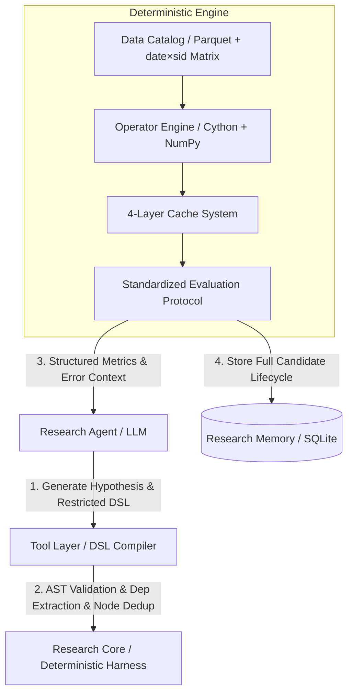

# A 股量化因子挖掘与 Agent 工作流引擎

> High-throughput quantitative factor mining, restricted DSL AST compiler, 4-layer caching, and automated testing pipeline for China A-share market — featuring decoupled AI Agent harness & ARIS cross-model adversarial review.


## Overview

This project provides a **quantitative factor research architecture** for China A-shares. Instead of letting LLMs write raw, unconstrained Python scripts that suffer from lookahead bias (future leakage) and un-reproducible rules, this system **decouples LLM hypothesis generation from a deterministic execution core (Harness)**.

Key capabilities include:

- **Decoupled AI Agent Harness Architecture**: LLM generates hypotheses and select operators; deterministic core executes PIT-aligned data calculations and backtests.
- **Restricted Expression DSL & AST Compiler**: High-performance parser (e.g. `cs_zscore(ts_return(close, 5))`) with static dependency checks, lookback window inference, and intermediate node deduping.
- **Columnar Storage & Matrix Compute Engine**: Parquet column-store + memory-mapped `date × sid` Float32 matrices using Polars, DuckDB, NumPy, and Cython.
- **4-Layer Persistent Cache System**: Data Matrix Cache, AST Intermediate Node Cache, Factor Matrix Cache, and Evaluation Cache with hash fingerprinting and incremental rollback logic.
- **Persistent Research Memory**: SQLite-backed knowledge base tracking candidate lifecycle, IC/IR, turnover, cross-factor correlation, and failed variant lineages.
- **8 Classic & 43 Extended Factor Families**: Beta, momentum, size, liquidity, volatility, quality, growth, CH-4, and q-factor models.
- **Daily IC/IR & Group Backtesting**: Spearman rank correlation, quintile portfolios, Fama-MacBeth regression with Newey-West standard errors.
- **24 Publication-Quality Figures & HTML Reports**: Automated PDF vector chart rendering and ARIS cross-model review loop.

### Key Results (A-Share Stocks, 73 Tickers)

| Factor | Mean IC | IR | Sharpe | FM t-stat | Verdict |
|--------|---------|----|--------|-----------|---------|
| beta_z | 0.0132 | 0.38 | 1.91 | 2.12 | ✅ Effective |
| momentum_6m_z | 0.0106 | 0.29 | 1.47 | 1.74 | ❓ Moderate |
| dollar_volume_z | 0.0081 | 0.24 | 1.25 | 1.56 | ❓ Moderate |
| st_reversal_1m_z | -0.0073 | -0.20 | -1.08 | -1.45 | ❓ Moderate |
| amihud_illiq_z | 0.0068 | 0.20 | 1.02 | 1.30 | ❓ Moderate |
| size_z | -0.0062 | -0.18 | -0.95 | -1.21 | ❓ Moderate |
| max_ret_1m_z | 0.0051 | 0.15 | 0.78 | 1.05 | ❌ Weak |
| ivol_capm_z | -0.0038 | -0.11 | -0.62 | -0.88 | ❌ Weak |

## System Architecture



### 🔄 Multi-Stage Pipeline Flow

```
                         ┌──────────────────────────┐
                         │   G001: Literature Survey  │
                         └───────────┬──────────────┘
                                     ▼
                         ┌──────────────────────────┐
                         │   G002: DSL Factor Mining │
                         └───────────┬──────────────┘
                                     ▼
                         ┌──────────────────────────┐
                         │   G003: Factor Testing     │
                         └───────────┬──────────────┘
                                     ▼
                ┌────────────────────────────────────┐
                │   G004: ARIS Adversarial Review     │◄──────────┐
                └───────────┬────────────────────────┘           │
                            │                                    │
                     ┌──────▼──────┐                      ┌──────┴──────┐
                     │  Review      │                     │  Reject      │
                     │  Passed?     │                     └──────┬──────┘
                     └──────┬──────┘                            │
                            │ Yes                               │ No
                            ▼                                   │
                ┌──────────────────────────┐                    │
                │   G005: Visualization +   │                    │
                │   Test Report             │                    │
                └───────────┬──────────────┘                    │
                            │                                    │
                     ┌──────▼──────┐                             │
                     │  Results OK? │──── No ─────────────────────┘
                     └──────┬──────┘
                            │ Yes
                            ▼
                ┌──────────────────────────┐
                │   G006: Final Report      │
                └──────────────────────────┘
```

## Quick Start

### Prerequisites

```bash
# Python 3.11+ with dependencies
pip install pandas numpy scipy matplotlib seaborn statsmodels scikit-learn yfinance
```

### Run Full Pipeline

```bash
# Run the complete workflow
python3 -m src.workflow_orchestrator --mode full --real-data
```

### Generate Figures (24 charts)

```bash
python3 -m src.workflow_orchestrator --mode figures
```

### Generate Report

```bash
python3 -m src.workflow_orchestrator --mode report
```

### Analyze Results

```bash
python3 -m src.workflow_orchestrator --mode analyze
```

## Pipeline Components

### Data Flow

1. **Data Loading**: yfinance → daily OHLCV for A-share constituents
2. **Factor Computation**: 8 classic factors computed daily
3. **IC Analysis**: Daily cross-sectional Spearman correlation
4. **Group Backtesting**: Equally-weighted quintile portfolios
5. **Fama-MacBeth Regression**: Cross-sectional regression with Newey-West s.e.
6. **Visualization**: 24 publication-quality charts (PDF)
7. **HTML Report**: Professional report with KPIs and embedded figures

### Factor Definitions

| Factor | Description | Expected Sign |
|--------|-------------|---------------|
| beta | CAPM beta (60-day rolling) | + |
| momentum_6m | 6-month cumulative return (1-month lag) | + |
| size | Log market cap | - |
| dollar_volume | 20-day avg trading volume × price | + |
| st_reversal_1m | 1-month reversal (short-term) | - |
| amihud_illiq | Amihud illiquidity measure | + |
| max_ret_1m | Maximum daily return over 1 month | - |
| ivol_capm | Idiosyncratic volatility (CAPM residuals) | - |

## Companion Project: Claude Code Skills Pack

This repo handles the Python computation pipeline. The **Claude Code skills** that orchestrate the end-to-end workflow (literature survey → mining → evaluation → final report) live in a separate companion project:

👉 **[ashare-factor-workflow](https://github.com/zhangpelf/ashare-factor-workflow)**

| Skill | Purpose |
|-------|---------|
| `auto-因子提取` | Pipeline orchestrator — 43 factors, 9 mining methods |
| `auto-因子分析` | IC/IR/Sharpe analysis, literature cross-reference |
| `auto-因子评估` | 6-dimension scoring (有效/可疑/无效) |
| `auto-因子图表` | 24 publication-quality figures |
| `auto-因子报告` | Structured report generation (Markdown + Excel) |
| `auto-撰写报告` | 8-module final report with decision gates |

## Output Structure

```
output/
├── factor_report.md           # Full Markdown report
├── factor_report.html          # HTML rendered report
├── factor_report_screenshot.png # Preview screenshot
├── ashare_factor_report.csv    # Factor testing summary
└── analysis_summary.json       # Analysis results

figures/
├── ic_series_*.pdf             # IC time series (8 factors)
├── cumulative_*.pdf            # Cumulative returns (8 factors)
├── distribution_*.pdf          # Factor distributions
├── factor_correlation_heatmap.pdf  # Correlation matrix
└── factor_dashboard.png        # Performance dashboard
```

## ARIS Adversarial Review

The system includes an adversarial review loop where Claude Code (implementer) and GPT (reviewer) iteratively critique and improve the research:

1. **Round 1**: Claude implements factor mining code
2. **Round 2**: GPT reviews code & results via Codex MCP
3. **Round 3**: Claude fixes issues based on review
4. **Round 4**: Re-review until passing threshold

## License

MIT

## Author

**Zhang Peifu** - [GitHub](https://github.com/zhangpelf)

---

## Acknowledgments

- This project references skills and workflows from the **ARIS (Adversarial Research Improvement System)** methodology, particularly the `auto-review-loop` for cross-model adversarial review between Claude and GPT.
- Factor testing methodology inspired by Cochrane's *Asset Pricing* (2005) and the growing "factor zoo" literature.
- A-share market data sourced via yfinance with CSI 300 index constituents.

---

*Built with Claude Code AI-assisted development. Part of the ARIS (Adversarial Research Improvement System) methodology.*
