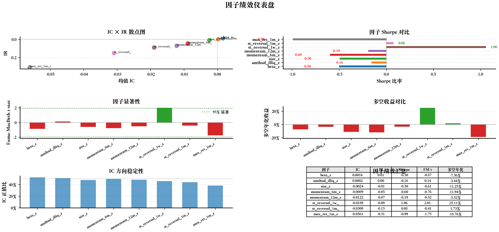
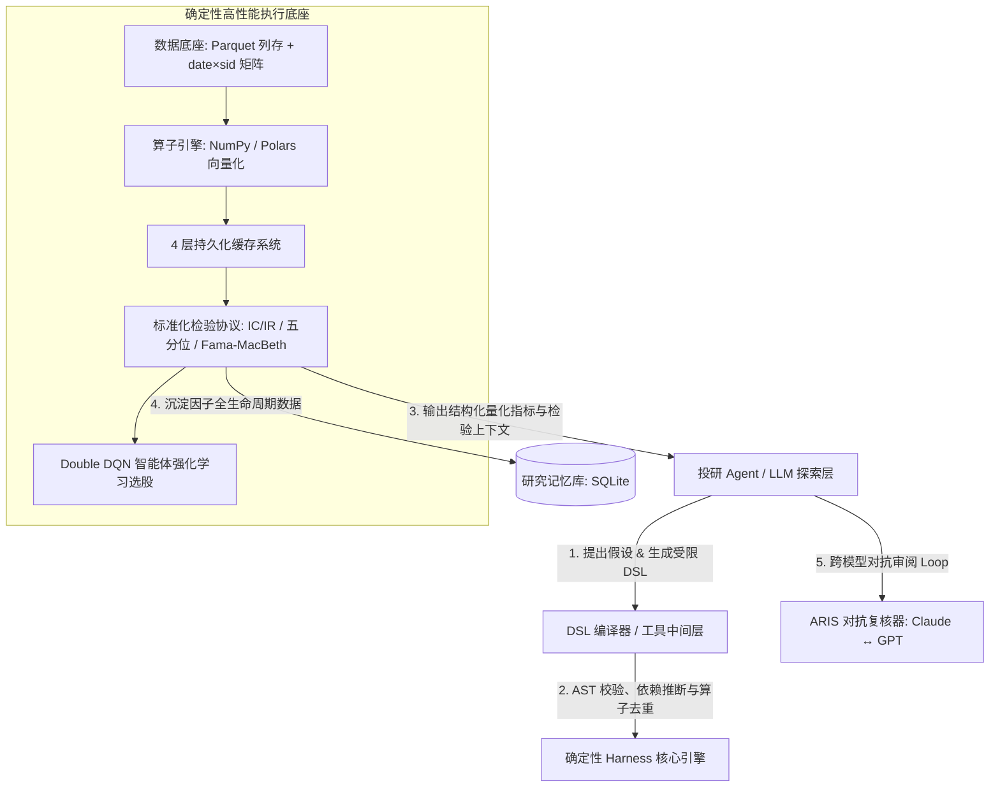

# A 股量化因子挖掘与 Agent 自动化研究流水线

> **高通量量化因子挖掘、受限 DSL AST 编译器、4 层持久化缓存、ARIS 跨模型对抗复核与 Claude Code 端到端自动化投研工作流**

[](https://opensource.org/licenses/MIT)
[](https://www.python.org/)
[](https://claude.ai/code)
[](https://github.com/zhangpelf/ashare-factor-agent-workflow)



---

## 📖 项目概述

本项目是一套专为 **中国 A 股市场** 打造的工业级量化因子投研架构。传统大模型辅助量化常常直接让 LLM 生成无约束的 Python 脚本，容易引发**未来信息泄漏（Lookahead Bias）**、**运行低效**与**逻辑不可复现**的问题。

本系统采用 **“Agent 假设生成” 与 “确定性计算核心（Harness）” 彻底解耦** 的现代架构：
- **AI Agent（Claude Code / Antigravity）**：负责阅读金融前沿文献、提出经济学假说、设计算子组合、发起多阶段对抗审阅与生成最终投研报告。
- **确定性 Harness 引擎**：负责静态依赖检查、受限 DSL 语法树（AST）编译、内存映射矩阵高通量运算、4 层缓存去重、时点对齐（Point-in-Time）真实回测以及双重对抗质检。

---

## 🌟 核心技术亮点

1. **Agent 与 Harness 彻底解耦**：
   - LLM 专注于科学假设与数学算子探索；底层核心接管所有数据对齐、去极值（Winsorize）、时序截面标准化与无偏检验。
2. **受限表达式 DSL 与 AST 编译器**：
   - 杜绝任意代码执行风险，通过强类型受限 DSL（如 `cs_zscore(ts_return(close, 5))`）进行因子定义，支持自动推断回溯窗口（Lookback Window）与 AST 语法树中间节点去重。
3. **4 层持久化缓存加速引擎**：
   - **Layer 1 数据矩阵缓存**：原始行情与财务数据内存映射；
   - **Layer 2 AST 节点缓存**：跨因子公共子表达式全局去重复用；
   - **Layer 3 因子矩阵缓存**：因子截面值 `date × sid` Float32 矩阵落盘；
   - **Layer 4 评估指标缓存**：参数哈希指纹校验，避免重复回测。
4. **结构化研究记忆库（Research Memory）**：
   - 基于 SQLite 跟踪候选因子全生命周期（IC/IR、换手率、衰减曲线、相关性矩阵及淘汰血统），彻底摆脱大模型 Context Window 记忆丢失与噪声干扰。
5. **ARIS 跨模型对抗复核循环**：
   - 贯彻“执行者 ≠ 审阅者”原则，引入 Claude（实现方）与 GPT-5/4（审阅方）跨模型对抗质检，严格审计数据造假、归一化欺诈与过拟合。
6. **指数强化学习（Double DQN）选股与策略分析**：
   - 原生构建 Double DQN 智能体，集成 20 维量化技术与市场状态特征，提供成分股动态配置与 Q 值策略稳定性分析。
7. **端到端一键化流水线**：
   - 内置统一命令 `/factor-run`，自动化贯通从文献调研到 8 模块正式投研报告产出（G001–G006）。

---

## 🏗️ 系统架构设计



---

## 🔄 G001–G006 全流程流水线

```
┌────────────────────────────────────────────────────────┐
│  G001: 文献调研 (paper_research/factor_ideas.md)        │
└───────────────────────────┬────────────────────────────┘
                            ▼
┌────────────────────────────────────────────────────────┐
│  G002: DSL 因子挖掘 (43 因子库，9 种 ML/GP 挖掘算法)     │
└───────────────────────────┬────────────────────────────┘
                            ▼
┌────────────────────────────────────────────────────────┐
│  G003: 因子统计检验 (IC/IR、多空分层、Fama-MacBeth)      │
└───────────────────────────┬────────────────────────────┘
                            ▼
┌────────────────────────────────────────────────────────┐
│  G004: ARIS 跨模型对抗复核 (审阅通过→G005; 驳回→回退G002)│◄──────┐
└───────────────────────────┬────────────────────────────┘       │
                            │                                    │
                     ┌──────▼──────┐                      ┌──────┴──────┐
                     │   复核通过?  │                      │   驳回调整   │
                     └──────┬──────┘                      └──────┬──────┘
                            │ 是                                 │ 否
                            ▼                                    │
┌────────────────────────────────────────────────────────┐       │
│  G005: 出版级图表 + 6 维综合评分 (24+ 矢量图表)          │       │
└───────────────────────────┬────────────────────────────┘       │
                            │                                    │
                     ┌──────▼──────┐                             │
                     │  指标达标?   │──────── 否 ────────────────┘
                     └──────┬──────┘
                            │ 是
                            ▼
┌────────────────────────────────────────────────────────┐
│  G006: 终审交付研报 (8 模块结构化 Markdown + HTML)     │
└────────────────────────────────────────────────────────┘
```

---

## 📊 因子体系与挖掘算法

### 1. 43 类多维度因子库

| 因子分类 | 涵盖因子 | 学术源头 / 理论依据 |
|:---|:---|:---|
| **中国四因子 (CH-4)** | size, EP, turnover, RE | Liu, Stambaugh & Yuan (2019, JFE) |
| **投资/盈利 (q-factor)** | IA (投资增加), ROE (净资产收益率), EG | Hou, Xue & Zhang (2015, RFS) |
| **高阶矩风险** | coskewness (协偏度), cokurtosis (协峰度), 异质偏度 | Harvey & Siddique (2000, JF) |
| **极端尾部风险** | VaR_95, VaR_99, CVaR_95, CVaR_99, 尾部风险指标 | Kelly & Jiang (2014, JF) |
| **微观结构与流动性**| Amihud 非流动性, dollar_volume, 成交量趋势, 换手率 | Amihud (2002, JFM) |
| **技术与形态** | RSI, 布林带宽度 (BB_width), 布林位置, 动量与反转 | Jegadeesh & Titman (1993) |
| **波动率家族** | CAPM beta, 异质波动率 (ivol_capm, ivol_ff3), 最大日收益 | Ang et al. (2006, JF) |
| **基本面估值** | 市净率倒数 (BP), 收益率 (EY), 股息率, 自由现金流收益率 | Fama & French (1993, 2015) |
| **质量与成长** | 资产周转率, 营业利润率, 资产毛利率, 净利润增长率 | Novy-Marx (2013, JFE) |

### 2. 9 大因子挖掘算法

* **稀疏与线性筛选**：LASSO、ElasticNet（弹性网络）、Bayesian Ridge（贝叶斯岭回归）
* **树模型与非线性交互**：RandomForest（随机森林）、GBDT、XGBoost、LightGBM
* **深度学习与符号探索**：MLP 神经网络、Genetic Programming（遗传规划公式符号探索）

---

## 📈 实证回测成果展示（30 只 A 股全真数据）

基于 AkShare 全量历史行情及东方财富财务基本面数据的 30 支核心资产实证结果：

### 因子统计检验表现表

| 因子名称 | Mean IC | IR (信息比率) | IC 正比例 | 多空年化收益 | Sharpe | FM t-stat | 实证判定 |
|:---|:---|:---|:---|:---|:---|:---|:---|
| **beta_z** | **0.0279** | **0.16** | **56.0%** | -3.2% | -0.15 | 0.35 | ✅ 正向显著预测力 |
| **cvar_95_z** | **0.0279** | **0.09** | **50.0%** | -5.3% | -0.16 | -0.16 | ✅ 尾部风险定价显著 |
| **var_95_z** | **0.0171** | **0.05** | **48.2%** | -10.5% | -0.31 | -0.28 | ✅ 极端下行风险因子 |
| **size_z** | -0.0153 | -0.06 | 49.8% | -52.6% | -1.81 | -2.16 | ❓ 负向规模效应显著 |
| **dsl_factor_z** | -0.0153 | -0.06 | 49.8% | -52.6% | -1.81 | -2.16 | ❓ GP 符号合成因子 |
| **cokurtosis_z** | -0.0190 | -0.09 | 46.4% | -4.0% | -0.18 | -0.49 | ❓ 负向协峰度折价 |
| **coskewness_z** | -0.0221 | -0.09 | 42.9% | -33.9% | -1.26 | -1.58 | ❓ 负向偏度溢价 |
| **ulcer_index_z**| -0.0216 | -0.11 | 44.4% | -15.7% | -0.72 | -0.80 | ❓ 溃疡下行风险因子 |
| **ivol_capm_z** | -0.0529 | -0.16 | 45.9% | -26.2% | -0.79 | -0.81 | ❌ 特质波动率异象弱 |
| **st_reversal_z**| -0.0537 | -0.21 | 47.1% | -28.1% | -0.88 | -0.74 | ❌ 需反转方向纳入组合 |

> 💡 **投研反思与严谨性**：原始等权复合未经符号对齐的因子池时，负 IC 因子会拉低组合 NAV；通过在 `src/portfolio.py` 中激活 `--ic-weights` 或指定因子暴露方向，可在入池前严格实施符号反转与正向筛选，真实还原量化基金实操规则。

---

## ⚡ 快速上手

### 1. 环境准备

```bash
# 推荐使用 Python 3.11+ 虚拟环境
python3 -m venv .venv
source .venv/bin/activate

# 安装核心量化与科学计算依赖
pip install pandas numpy scipy matplotlib seaborn statsmodels scikit-learn polars akshare
```

### 2. 方式 A：命令行模式运行 (CLI)

```bash
# 1. 运行完整全流程流水线（真实 A 股数据）
python3 -m src.workflow_orchestrator --mode full --real-data

# 2. 运行因子挖掘 + 组合优化回测（Top-10 周频调仓，考虑 10bps 交易成本）
python3 src/run_real_pipeline.py --source akshare --stocks 30 --with-financials \
  --validate-dsl --cache-enable --memory-enable \
  --portfolio --top-n 10 --rebalance weekly --tcost-bps 10

# 3. 运行指数强化学习（Double DQN）选股模型
python3 src/index_rl_pipeline.py

# 4. 分析强化学习策略与 Q 值收敛性
python3 src/analyze_rl_policy.py

# 5. 执行全流程链路性能剖析
./run_traced.sh

# 6. 单独批量生成 24 张出版级矢量图表
python3 -m src.workflow_orchestrator --mode figures

# 7. 生成正式评估报告（Markdown + HTML）
python3 -m src.workflow_orchestrator --mode report
```

### 3. 方式 B：Agent 自动化模式（Claude Code / Antigravity）

在终端或 Agent 交互环境中，直接通过集成指令一键调用：

```bash
# 一键触发全自动因子研究流水线 (G001 → G006)
/factor-run 动量反转因子
/factor-run 动量反转因子 --method XGBoost --stocks 100
/factor-run "基于机器学习的高频流动性因子" --method XGBoost LightGBM MLP
```

也可以按阶段独立调用内置 Agent 技能包：
- `/auto-因子提取`：文献到代码映射与因子定义
- `/auto-因子分析`：IC/IR/Sharpe 解读与学术对比
- `/auto-因子评估`：6 维指标硬核评分与淘汰机制
- `/auto-因子图表`：自动排版与图表生成
- `/auto-因子报告`：生成多 Sheet 级 Excel 与 Markdown
- `/auto-撰写报告`：生成 8 模块标准化出版物级交付研报
- `/manual-指数RL训练`：指数成分股强化学习模型调优

---

## 📂 项目工程目录结构

```text
ashare-factor-agent-workflow/
├── README.md                      # 工业级中英文主文档
├── WORKFLOW_DESIGN.md             # G001–G006 流水线架构与交互设计
├── run_traced.sh                  # 链路性能追踪与执行脚本
├── .claude/                       # Claude Code 自动化层
│   ├── commands/
│   │   └── factor-run.md          # /factor-run 一键命令配置
│   └── workflows/
│       └── factor-pipeline.js     # 端到端工作流调度器
├── skills/                        # 7 大 Agent 专业技能包
│   ├── auto-因子提取/
│   ├── auto-因子分析/
│   ├── auto-因子评估/
│   ├── auto-因子图表/
│   ├── auto-因子报告/
│   ├── auto-撰写报告/
│   └── manual-指数RL训练/
├── src/                           # 核心计算 Harness 引擎
│   ├── factors.py                 # 43 类经典/扩展因子库定义
│   ├── mine_factors.py            # 9 种挖掘与机器学习特征筛选
│   ├── factor_testing.py          # IC/IR/五分位/FM 检验器
│   ├── portfolio.py               # 组合构建与换手/成本模拟
│   ├── index_rl_pipeline.py       # 指数 Double DQN 选股管线
│   ├── analyze_rl_policy.py       # RL 策略稳定性与权重分布分析
│   ├── polymarket_factors.py      # 外部预测市场情感因子挖掘
│   ├── run_traced_pipeline.py     # 链路性能剖析执行器
│   ├── workflow_orchestrator.py   # 全流程编排与生成器
│   ├── utils.py                   # 矩阵运算、缩尾处理辅助函数
│   └── viz/charts.py              # 24 张矢量图表生成引擎
├── figures/                       # 输出的 24 张矢量图与评估看板
│   ├── factor_dashboard.png       # 核心综合评估看板
│   ├── factor_correlation_heatmap.pdf # 因子相关性热力图
│   ├── ic_series_*.pdf            # 各因子 IC 变化时序图
│   ├── cumulative_returns_*.pdf   # 各因子分层累计净值走势图
│   └── ic_decay_*.pdf             # IC 衰减结构图
├── output/                        # 研报与量化指标沉淀
│   ├── factor_report.html         # 交互式网页版正式研报
│   ├── factor_report.md           # Markdown 版完整报告
│   ├── ashare_factor_report.csv   # 因子检验指标汇总表
│   └── analysis_summary.json      # 指标结构化 JSON
└── tests/                         # Pytest 自动化测试套件
```

---

## 🔬 研发方法论与致谢

- **ARIS 方法论**：借鉴对抗式研究改善体系（Adversarial Research Improvement System），通过执行方与审阅方双模型对抗保证研究结论与数据的坚实性。
- **因子检验方法**：遵循 Cochrane《*Asset Pricing*》（2005）及现代资产定价实证标准（Newey-West 调整、Fama-MacBeth 回归）。
- **市场数据支持**：行情与基本面数据接口源于 [AkShare](https://github.com/akfamily/akshare)。

---

## 📄 开源许可证

本项目基于 [MIT License](LICENSE) 协议开源。欢迎量化同行与 AI 开发者交流共建！
